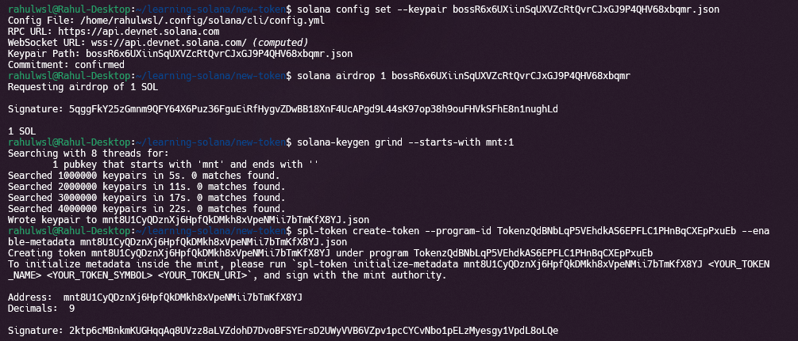
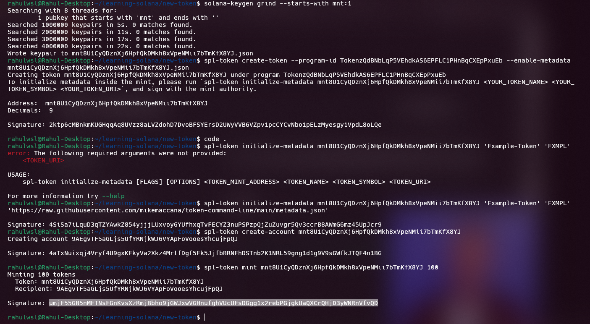

# Example Token Creation on Solana

This readme contains the steps and information for creating a new example token on the Solana blockchain using the Solana CLI.


## Overview

This guide demonstrates how to:
1. Create custom authorities using `solana-keygen grind`.
2. Configure the Solana CLI to use a specific authority.
3. Create a new token with the defined mint authority.
4. Mint tokens to an address.
5. Check token balances.
---

## Steps to Create a Custom Mint Authority and Token

### Step 1: Generate a Custom Key Pair for the Fee Payer Authority
Run the following command to create a key pair with a desired prefix, such as `bos`:
```bash
solana-keygen grind --starts-with bos:1
```
- The `--starts-with` flag ensures the public key starts with bos.

### Step 2: Set the Generated Key Pair as the Default Config
To use the generated key pair for transactions (as the fee payer), configure Solana to use it:
```bash
solana config set --keypair /path/to/bos-authority.json
``` 


### Step 3: Generate a Custom Mint Authority
Next, create another key pair for the mint authority with a different prefix, such as mnt:
```bash
solana-keygen grind --starts-with mnt:1
```

### Step 4: Create a New Token with the Custom Mint Authority
Create a new token and specify the custom mint authority:
```bash
spl-token create-token --mint-authority /path/to/mint-authority.json
```
- The mint authority ensures only the specified key pair can mint tokens.

### Step 5: Create a Token Account
A token account is required to hold the tokens:
```bash
spl-token create-account <MINT_ADDRESS>
```

Here's the new section to add to your `README.md` for setting custom metadata like token name, symbol, and URI:

---

### Step 8: Add Custom Metadata to the Token

To add metadata to your token, such as its name, symbol, and URI, you'll need to use the **Metaplex Token Metadata program**. Follow these steps:

1. **Install the Required Tools**
   Ensure you have the Solana CLI and the `metaplex` command-line tool installed. You can install the Metaplex tool with:
   ```bash
   npm install -g @metaplex-foundation/cli
   ```

2. **Prepare Metadata**
   Create a JSON file with the metadata information. For example, create a file named `metadata.json`:
   ```json
   {
     "name": "Example-Token",
     "symbol": "EXMPL",
     "uri": "https://example.com/metadata.json",
     "seller_fee_basis_points": 0,
     "creators": [
       {
         "address": "mntExamplePublicKey123456789",
         "verified": true,
         "share": 100
       }
     ]
   }
   ```
   - **`name`**: The token name.
   - **`symbol`**: The token symbol.
   - **`uri`**: A link to the metadata JSON file hosted online (often points to an IPFS or web URL).
   - **`seller_fee_basis_points`**: Royalty percentage (set to 0 for standard tokens).
   - **`creators`**: An array of creators with their wallet addresses, verification status, and share allocation.

3. **Set the Metadata**
   Use the Metaplex CLI to set the token metadata:
   ```bash
   metaplex tokens update-metadata <MINT_ADDRESS> --metadata-file metadata.json --update-authority /path/to/mint-authority.json
   ```
   - Replace `<MINT_ADDRESS>` with the token mint address.
   - Provide the path to the JSON metadata file.
   - Use the mint authority to authenticate the update.

4. **Verify the Metadata**
   To verify that the metadata is correctly set, use:
   ```bash
   metaplex tokens show <MINT_ADDRESS>
   ```

---
---
### Screenshot 1

---
### Screenshot 2


